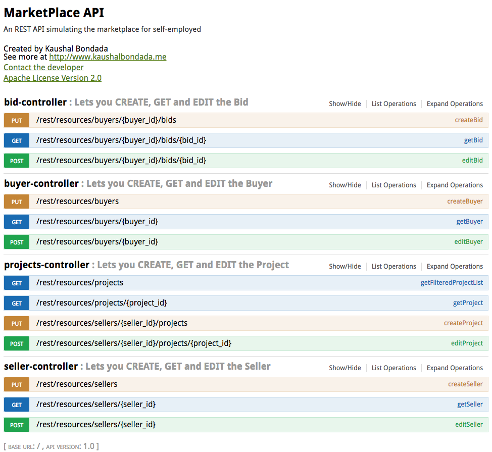

# MarketPlace

Here is the place to find more documentation when you run the code - http://localhost:8080/swagger-ui.html

## Running Instructions

* Prerequisites
  * Java 8
  * maven 3

* Build
  > mvn clean install

* Package
  > mvn clean package

* Run
  > java -jar target/marketplace-0.0.1-SNAPSHOT.jar 

### Feedback

**The time the exercise took**
*12 hours (some extra time for cleaning and documentation)*

**Exercise Difficulty** *Difficult*

**How did you feel about the exercise itself? (1 lowest, 10 highest—awesome way to assess coding ability)**
*9. The exercise is a very open. so there are many areas to concentrate on. I had to limit the size due to the time constraints.*

**How do you feel about coding an exercise as a step in the interview process?**
*8. The exercise is very good at bringing the strong technical areas out in the open. you could spend on a lot of time depending on which areas you would want to spend time on. I have spent a lot of time designing the code so that it can be extended to any data store and also add models by making a little modifications to the API iteself. All by making sure that it can be scalable and performant*
