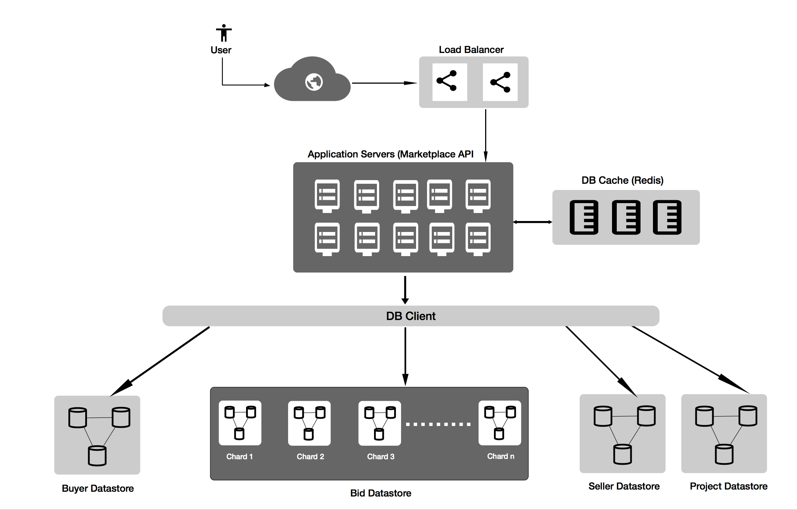

# MarketPlace

Here is the place to find more documentation when you run the code - http://localhost:8080/swagger-ui.html

## Running Instructions

* Prerequisites
  * Java 8
  * maven 3

* Build
  > mvn clean install

* Package
  > mvn clean package

* Run
  > java -jar target/marketplace-0.0.1-SNAPSHOT.jar 

## Design Philosophy

* Ease of Use
  * Well Documented with swagger documentation
  * modularized code following common design principles and following REST protocol.
* extendable
  * pluggable datstores
  * common interfaces to add new models
* scalabale
  * Well thought out scalable architecture. preview of how it looks 
  * 
* inbuild security
  * Request Paths with inherent relation mappings
  * future features (API key authentication,) 

## Upcoming features

* Adding more models and functionality for the models
* API key authentication
* Rate limiting and other advanced functionality added by AWS Integration
* Adding ID as a self generated field.(sharding and security)

